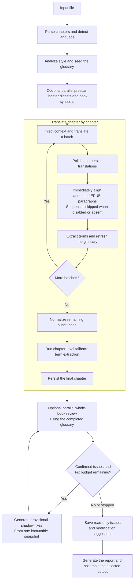

<div align="center">

# 📚 Wenyi

**One command, from EPUB to a readable Chinese translation.**

Whole-book analysis · Real-time glossary · Multi-stage review

[](https://www.python.org/)
[](https://github.com/BigDawnGhost/wenyi/actions/workflows/tests.yml)
[](LICENSE)
[](https://github.com/BigDawnGhost/wenyi/stargazers)
[](https://discord.gg/sM3AQcF5D2)

**English** | [简体中文](docs/zh/README.md)


</div>

---

## Table of contents

- [Why Wenyi](#why-wenyi)
- [Core features](#core-features)
- [Quick start](#quick-start)
- [Supported formats](#supported-formats)
- [Translation pipeline](#translation-pipeline)
- [Documentation](#documentation)
- [Limitations](#limitations)
- [Community](#community)
- [Star history](#star-history)
- [License](#license)

---

## Why Wenyi

| Typical approach | Wenyi |
|---|---|
| Segments translated in isolation, unaware of surrounding content | Whole-book prescan with chapter digests and rolling context |
| Glossary managed manually or as an afterthought | Real-time term extraction with conflict detection, fed back into subsequent batches |
| Single-pass translation, fragile to interruptions | Batch checkpoints and chapter status tracking: resume any interrupted run with the same command |
| Raw model output, no systematic quality process | Translate → polish → evidence-driven whole-book review |

Wenyi is designed for **long-form texts** — novels, social-science monographs, narrative nonfiction, and more.

---

## Core features

- **Whole-book understanding** — prescans the source before translation, creating per-chapter digests and a book-level synopsis injected into every batch
- **Real-time glossary** — extracts proper names, terms, and recurring expressions as translation progresses; detects conflicting translations and surfaces them for resolution
- **Multi-stage quality** — optional polishing (strong model) and an evidence-driven whole-book AI review
- **Resumability** — batch-level checkpoints, chapter status tracking, and atomic state writes; interrupt at any point and resume with the same command
- **Multiple LLM providers** — DeepSeek, OpenAI, OpenRouter, Google Gemini, Ollama, vLLM, and generic OpenAI-compatible endpoints
- **Native EPUB preservation** — writes translated text back into the original XHTML templates and attempts to preserve styles, images, TOC, and anchors
- **Bilingual output** — optional source-and-translation edition with visually subdued source text, including dark mode support

---

## Quick start

### Prerequisites

Wenyi requires Python 3.10+ and [uv](https://docs.astral.sh/uv/).

### Installation

```bash
git clone https://github.com/BigDawnGhost/wenyi.git
cd wenyi
uv sync
```

### Configuration

Set your API key:

```bash
export DEEPSEEK_API_KEY=sk-...
```

### One-command translation

```bash
uv run trans-novel translate book.epub
```

This parses the book, detects the source language, prescans for understanding, translates all chapters, and assembles the output. The monolingual Chinese EPUB is written to `output/book.zh.epub` by default.

### Step-by-step workflow

```bash
# 1. Prepare — parse, analyze, prescan (no body text translated)
uv run trans-novel prepare book.epub

# 2. Translate — resume from the prepared state
uv run trans-novel translate book.epub

# 3. Review — independent final review against the completed glossary
uv run trans-novel review book.epub

# 4. Check progress
uv run trans-novel status book.epub
```

### Interrupt and resume

Every completed batch is persisted immediately. If a run is interrupted, execute the same command again:

```bash
uv run trans-novel translate book.epub
```

### Command-line overrides

```bash
uv run trans-novel translate book.epub --polish --review          # enable polishing and final review
uv run trans-novel translate book.epub --no-polish                # disable polishing
uv run trans-novel translate book.epub --bilingual                # produce both editions
uv run trans-novel translate book.epub --chapter 0                # translate the first chapter (indices start at 0)
uv run trans-novel translate book.epub --format txt               # export as plain text
```

Final review is disabled by default. Set `pipeline.review: true` to run it
automatically after the complete book has been translated and the glossary has
reached its final state, or run Agent Review independently:

```bash
uv run trans-novel review book.epub
```

Each Review run starts from the beginning, checks chunks concurrently, and can
selectively request cross-book evidence before resolving contradictory
consistency suggestions. Confirmed issues can produce provisional full-segment
replacements in a run-local shadow translation. A fresh whole-book review sees
the shadow text—but not the previous issue explanation—and validates it again.
Formal translation state is never modified. The consolidated read-only result,
run usage, events, and internal round records are written under
`state/<book>/reviews/review-<timestamp>/`.

---

## Supported formats

| Input | Output |
|---|---|
| EPUB, FB2, TXT, Markdown, HTML, PDF, DOCX | EPUB (monolingual / bilingual), TXT, HTML, Markdown, DOCX |
| SRT (movie / series subtitles) | `.zh.srt` (monolingual) and optional `.zh-bi.srt` (bilingual) |

- PDF input requires `MINERU_API_KEY` for the initial conversion; the resulting HTML is cached and reused.
- EPUB output attempts to preserve the original book's styles, images, table of contents, and anchors. Vertical layout is converted to horizontal for Chinese reading.
- Source language is auto-detected by default, or fixed to an ISO 639-1 code in `config.yaml`.
- `.srt` input is auto-detected by `translate`. It uses a light concurrent path (no glossary, polish, or whole-book review). State lives under `state/srt/<slug>/`; outputs default to the source file's `output/` directory. Details: [Usage guide](docs/usage.md#srt-subtitles).
- `.docx` input uses the full book pipeline. Headings, simple tables, lists, and common run/paragraph styles are preserved where possible; translated Chinese uses Song (宋体). Default export is `.zh.docx` (override with `--format`). Details: [Usage guide](docs/usage.md#docx-word).

---

## Translation pipeline



When enabled, the prescan runs in parallel with configurable concurrency and is idempotent — completed digests are reused across runs. During translation, each batch receives the most recent glossary snapshot and translated context, keeping pronouns, terms, and tone consistent across chapters.
The Review Fixer receives the same style brief, book synopsis, chapter digest,
relevant glossary subset, and nearby source/translation context used to preserve
the book's voice. Its replacements remain temporary review suggestions.

---

## Documentation

- [Usage guide](docs/usage.md) — installation, Windows setup, input/output, resumability, independent stages
- [Configuration](docs/configuration.md) — providers, languages, pipeline switches, segmentation, paths
- [Translation pipeline](docs/pipeline.md) — whole-book analysis, terminology, context, polishing, review
- [Contributing](CONTRIBUTING.md) — development, testing, and contribution guidelines

Translated state directories for public-domain books may be shared through [wenyi-bookcase](https://github.com/BigDawnGhost/wenyi-bookcase). Do not publish copyrighted text, private books, or `state/` directories containing sensitive information without permission.

---

## Limitations

- The translation pipeline is optimized for Simplified Chinese output; other target languages are not supported.
- Polishing and final review are the most expensive stages. Shadow fixing may
  trigger multiple full-book review passes and additional Fixer calls.
- PDF input depends on the MinerU external service; the initial conversion requires an API key.
- SRT translation is a light concurrent path: no glossary, polishing, or whole-book review, and slug collision is possible for identically named files in different folders.
- Translation quality is bounded by the capabilities of the chosen LLM model.
- Very long books may produce large state directories; storage requirements grow with book length.

---

## Community

- [Discord server](https://discord.gg/sM3AQcF5D2)
- QQ group: 1055065098
- [GitHub Issues](https://github.com/BigDawnGhost/wenyi/issues) — bug reports and feature requests
- [GitHub Discussions](https://github.com/BigDawnGhost/wenyi/discussions) — ideas and questions

---

## Star history

<a href="https://star-history.dera.page/#BigDawnGhost/wenyi&type=date&legend=top-left">
 <picture>
   <source media="(prefers-color-scheme: dark)" srcset="https://star-history.dera.page/svg?repos=BigDawnGhost/wenyi&type=date&theme=dark&legend=top-left" />
   <source media="(prefers-color-scheme: light)" srcset="https://star-history.dera.page/svg?repos=BigDawnGhost/wenyi&type=date&legend=top-left" />
   
 </picture>
</a>

---

## License

[MIT](LICENSE)

---

## AtomGit (China)

Wenyi is also hosted on AtomGit: [https://atomgit.com/BigDawnGhost/wenyi](https://atomgit.com/BigDawnGhost/wenyi)


## macOS 原生 App

仓库包含支持 macOS 15+ 的 SwiftUI 客户端。它使用用户本机的 Python 3.10+ 运行同一套翻译引擎，支持书架管理、多本图书无限制并行、断点续跑、独立进度和完成通知。

开发运行：

```bash
./script/build_and_run.sh --verify
```

首次使用请在设置中选择 Python 3.10+、统一输出目录，并填写 OpenAI 兼容端点及 strong、cheap、fast 三档模型。

