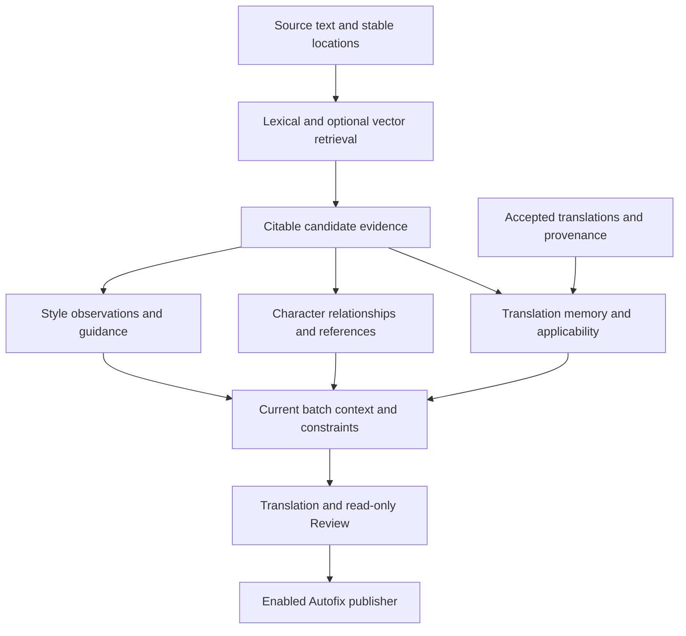

# Wenyi project review and roadmap · 2026-09-05

[简体中文](../../zh/project-review/2026-09-05/README.md)

This review documents **9 reproduced defects** and **10 roadmap proposals**, including the user's additions on semantic retrieval, repeated-expression consistency, style analysis, character evidence, and multilingual internationalization. Each has its own document with a Chinese counterpart. Prioritize formal publication, source-file protection, and subtitle correctness before quality evaluation and refactoring. Layering, persistence, and offline tests already provide a useful foundation; combined failure conditions need stronger coverage.

## Baseline and scope

- Revision: `15943b97592dc38ef9712412b6fd83a41951e1ca`; no tracked source changes were present at the start.
- Local Linux, Python 3.12.13. Python 3.10, Windows/macOS, and release binaries were not exercised in this session.
- Reviewed CLI/config, orchestration/domain services, persistence/locks, translation/prescan/Review/Autofix, subtitles, glossary/evidence, exports/HTML resources, HTTP bridge, related tests, bilingual docs, and CI.
- Method: source/test cross-reading, the full offline suite, and temporary-fixture probes. Format internals received targeted review and existing regression coverage, not exhaustive line-by-line inspection.
- Private books and existing runtime data were not read. Pre-existing untracked `review-20260812-075714-029447/` was excluded and untouched. Local books, state, output, and caches were not used as fixtures.
- No real LLM, embedding, MinerU, or BabelDOC calls; no remote CI/branch-protection inspection or current pricing verification. Defects apply to this source snapshot and the stated local experiments. Historical source links are pinned to the reviewed commit to avoid line-number drift. P06/P08/P09 additionally cite primary research, and P10 cites language-tag standards and Python resource documentation, consulted without submitting user book text. Those papers inform design and do not validate new Wenyi capabilities.

## Modification recommendations

P1 prioritizes source/formal-text protection, determinism, and completion correctness. P2 covers correctness, quality, and diagnosis under specific inputs/configuration/recovery conditions. Unverified hypotheses are not presented as reproduced defects.

| Independent document | Priority | Evidence |
|---|---|---|
| [F01 · Pending Autofix publication ignores the disabled setting](f01-autofix-disable-on-resume.md) | P1 | Reproduced |
| [F02 · An explicit export path can overwrite the source before validation fails](f02-export-source-protection.md) | P1 | Reproduced |
| [F03 · Overlapping tail windows make subtitle output order-dependent](f03-srt-window-determinism.md) | P1 | Reproduced |
| [F04 · Failed and empty subtitle translations are marked complete](f04-srt-failure-state.md) | P1 | Reproduced |
| [F05 · Review cache identity omits models and glossary evidence](f05-review-cache-identity.md) | P2 | Reproduced |
| [F06 · Recovering a chapter digest leaves the book synopsis stale](f06-prescan-synopsis-invalidation.md) | P2 | Reproduced |
| [F07 · HTML resource containment checks do not resolve symlinks](f07-html-resource-symlinks.md) | P2 | Reproduced |
| [F08 · Expected language-detection and configuration errors escape CLI handling](f08-cli-error-contract.md) | P2 | Reproduced |
| [F09 · Concurrent subtitle runs lack a shared run lock](f09-srt-run-lock.md) | P1 | Reproduced |

F03 uses reversed merge ordering as a deterministic counterexample. F09 forces a storage race between independent store instances; full multiprocess CLI stress testing remains future work. Each document specifies triggers, locations, scope, acceptance, and effort, without estimating real-world incidence from a local probe.

## Roadmap proposals

- [P01 · Version persistent state and provide verifiable recovery tools](p01-state-evolution-and-recovery.md)
- [P02 · Build long-form quality benchmarks and evaluate complete prescan coverage](p02-long-form-quality-evaluation.md)
- [P03 · Add request budgets, concurrency limits, and cancellation](p03-request-budgets-and-backpressure.md)
- [P04 · Separate the Review state machine and strengthen service contracts](p04-review-state-machine-refactor.md)
- [P05 · Validate code, document artifacts, and release binaries in CI](p05-ci-and-release-validation.md)
- [P06 · Introduce semantic retrieval with traceable whole-book evidence](p06-semantic-evidence-retrieval.md)
- [P07 · Use translation memory for repeated expressions in equivalent contexts](p07-translation-memory-consistency.md)
- [P08 · Strengthen style analysis with stratified samples and source evidence](p08-evidence-backed-style-analysis.md)
- [P09 · Resolve kinship and references through character-linked evidence](p09-character-kinship-evidence.md)
- [P10 · Multilingual translation and prompt internationalization (experimental implementation on 2026-09-06)](p10-multilingual-internationalization.md)

P01–P09 remain separable proposals. P10 now has a first experimental implementation following the subsequent request; its quality evaluation and remaining internationalization stages are documented separately. GUI/Web and new formats remain deferred.

## Shared design for the new quality directions

All four capabilities share stable source locations and versioned evidence, while owning different decisions.

| Capability | Supplies | Conditions for a firm decision |
|---|---|---|
| P06 semantic retrieval | Potentially relevant source passages and historical expressions | Candidate recall only; rank is neither truth nor equivalence |
| P07 translation memory | Accepted repeated-expression renderings and valid variants | Verify meaning, speaker, reference, and style scope; approximate matches remain suggestions |
| P08 style analysis | Evidenced global/local translation guidance | Adequate coverage and verifiable support/counterexamples; retain character differences |
| P09 character evidence | Relationships, relative age, and referent candidates | Source support, identity, direction, and narrative scope must hold; otherwise retain uncertainty |



Sibling age is relative: identifying the person denoted by brother still does not establish whom they are older than. Whole-book evidence can inform understanding without revealing later plot information in earlier translation. Cached or repeated translations cannot replace independent source evidence.

## Recommended sequence

| Milestone | Work | Exit criteria |
|---|---|---|
| M1: next stability release | F01, F02 path protection, F03, F04, F09; optionally P05 basic lint | Disabled publication preserves targets; source paths are protected; subtitle ordering/failure/concurrency regressions pass |
| M2: cache and diagnosis | F05–F08, P01 read-only diagnosis, F02 atomic artifacts | Semantic changes invalidate caches; partial prescan recovery is correct; expected errors are actionable; failed exports preserve existing artifacts |
| M3: quality and resource control | P02, P03, P05 binary/format checks | Long-form comparison report, defined budgets/cancellation, reproducible packaged smoke tests |
| M4: state evolution and structure | P01 migration/accounting, P04 | Reviewable identity-preserving migration and full validation of behavior-preserving refactoring |

For one contributor, rough estimates are 2–3 weeks for M1, 2–3 for M2, 3–4 for M3, and 2–4 for M4. These are planning estimates, not dates or commitments; real-model evaluation, external coordination, and human long-form review are excluded. Work can overlap by responsibility. Define P01/P03 accounting contracts early and refactor after corrected behavior and quality baselines exist.

The new quality track is **additional to those M1–M4 estimates**. It need not wait for all refactoring, but relevant correctness fixes and a minimal P02 evaluation set should come first.

| Increment | Scope | Acceptance focus |
|---|---|---|
| Q1: explainable foundations | P07 exact memory/reports, P08 stratified sampling, P09 explicit names/older/younger evidence reports | Verifiable citations, valid repeated-expression variation, no unsupported age guesses |
| Q2: semantic recall | P06 read-only/hybrid retrieval, then relationship/style queries | Recall versus lexical baseline, hard negatives, resumable indexing, budgets |
| Q3: combined quality control | P07 conditional reuse, P08 layered guidance, P09 cross-chapter inference/narrative scope | Preserve meaning, avoid early identity reveals, maintain Review/Autofix boundaries |

Define the P06 retrieval interface early. Initial P07/P08/P09 versions can use existing lexical/context evidence without circular prerequisites. Per-topic documents estimate prototype/follow-up work; real embedding/model and human evaluation costs are separate.

## Validation and reproduction

| Check | Result |
|---|---|
| `uv run --no-sync pytest -q` | Initial audit baseline: **562 passed, 44 subtests passed**; subsequent P10 feature validation is recorded separately |
| Related existing tests: preparation, glossary_agents, review_agent, translator, architecture_boundaries, orchestrator_contract | **105 passed, 3 subtests passed**; validates existing behavior, not implementation of P06–P09 |
| P10 validation including English defaults and metadata contracts (2026-09-06) | **611 passed, 44 subtests passed**, including 49 multilingual and metadata-language tests; no real model calls |
| P10 package resources | Wheel/sdist built from an isolated source copy; 54 resources match byte for byte; wheel-based `languages` works from another cwd |
| `uv run --no-sync ruff check .` | Passed |
| `uv run --no-sync ruff format --check .` | Passed |
| Shared probe | All F01–F09 symptoms observed |
| Documentation checks | Local links, source line numbers, bilingual file pairing, and whitespace passed across 40 Markdown files |
| `git diff --check` | Passed; untracked additions also received a separate whitespace check |

The script asserts old symptoms and should run against the reviewed source revision; F08 behavior has since changed in this working tree:

```bash
UV_CACHE_DIR=/tmp/wenyi-uv-cache uv run --no-sync python docs/project-review/2026-09-05/reproduce.py
```

[Offline reproduction script](reproduce.py). It uses authored fixtures and FakeClient only, creating and automatically removing data under temporary `/tmp/wenyi-review-*` directories. F02 overwrites only its own temporary source; F07 reads only its benign generated link target. The script asserts symptoms of the reviewed revision. **It is not a regression suite expected to remain green after fixes.** Convert each counterexample into desired-behavior tests when implementing its fix.

## Delivery and limitations

The audit and extension add 40 Markdown files across two languages: 19 independent topics and one index per language, plus one shared probe script. The 2026-09-05 audit and first nine proposals changed no product source, configuration, existing tests, or CI. P10 adds a subsequent implementation, tests, and documentation on 2026-09-06; see its separate document. Nothing was staged, committed, or pushed. P06–P09 are design documents only; no real vector index, translation memory, or character relationship store has been built.

The subsequent P10 implementation fixes the reproduced F08 language-detection/YAML CLI display failures. The other audit defects still require follow-up. Passing existing tests does not establish complete crash-window, multiwriter, format-preservation, or real translation-quality coverage. This is not an exhaustive security audit. The proposed scopes and acceptance criteria are ready to guide individual fix PRs.
