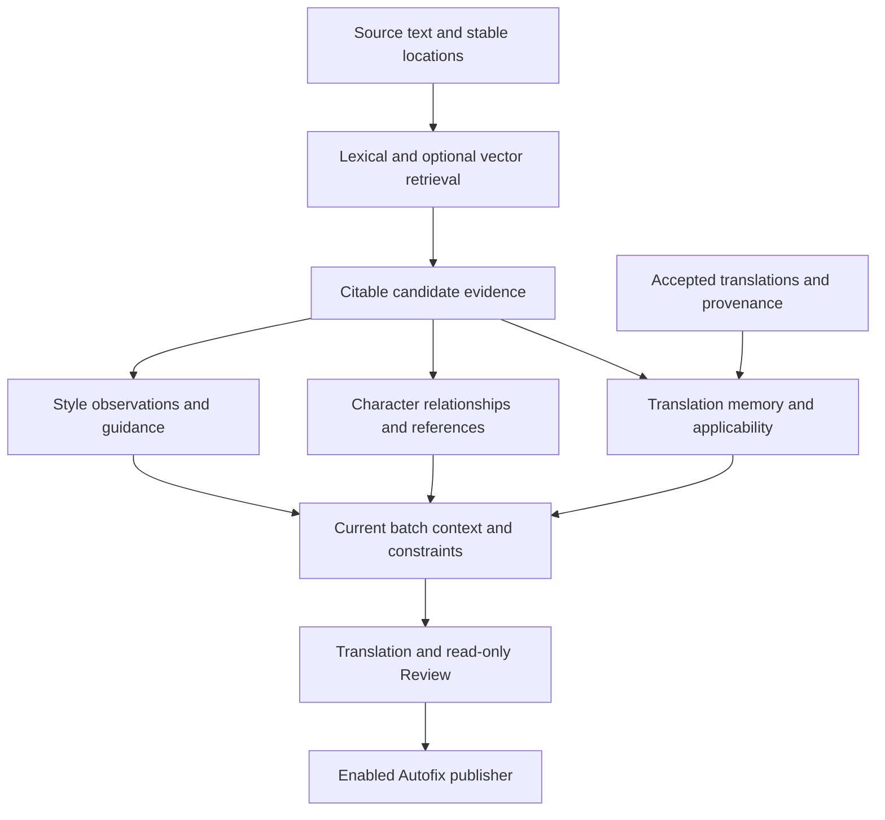

# Project review and retained proposals

[简体中文](../../zh/project-review/2026-09-05/README.md)

Cleanup on 2026-09-17 removed the seven completed refactoring plans, P04 Review extraction,
and P10's initial multilingual design. Current behavior lives in the [module map](../../architecture.md),
[configuration](../../configuration.md), [pipeline](../../pipeline.md), and [Web deployment](../../web.md)
guides. Old milestones, estimates, and claims that Web is deferred no longer describe the backlog.

## Retained proposals

P01/P02/P06–P09 retain future design value. P03/P05 are partially implemented; reassess
remaining work against current code instead of repeating the 2026-09-05 implementation
baseline. IDs are unchanged so individual proposals remain addressable.

- [P01 · State evolution and verifiable recovery](p01-state-evolution-and-recovery.md)
- [P02 · Long-form quality evaluation](p02-long-form-quality-evaluation.md)
- [P03 · Budgets and resource control: partially implemented](p03-request-budgets-and-backpressure.md)
- [P05 · CI and release validation: partially implemented](p05-ci-and-release-validation.md)
- [P06 · Semantic evidence retrieval](p06-semantic-evidence-retrieval.md)
- [P07 · Translation memory and consistency](p07-translation-memory-consistency.md)
- [P08 · Evidence-backed style analysis](p08-evidence-backed-style-analysis.md)
- [P09 · Character, kinship and reference evidence](p09-character-kinship-evidence.md)

## Shared design for the new quality directions

All four capabilities share stable source locations and versioned evidence, while owning different decisions.

| Capability | Supplies | Conditions for a firm decision |
|---|---|---|
| P06 semantic retrieval | Potentially relevant source passages and historical expressions | Candidate recall only; rank is neither truth nor equivalence |
| P07 translation memory | Accepted repeated-expression renderings and valid variants | Verify meaning, speaker, reference, and style scope; approximate matches remain suggestions |
| P08 style analysis | Evidenced global/local translation guidance | Adequate coverage and verifiable support/counterexamples; retain character differences |
| P09 character evidence | Relationships, relative age, and referent candidates | Source support, identity, direction, and narrative scope must hold; otherwise retain uncertainty |

Sibling age is relative: identifying the person denoted by brother still does not establish whom they are older than. Whole-book evidence can inform understanding without revealing later plot information in earlier translation. Cached or repeated translations cannot replace independent source evidence.

## Historical audit evidence

F01–F09 describe the old source audit at `15943b97592dc38ef9712412b6fd83a41951e1ca`.
They retain problem background and boundary cases, **not a list of currently unfixed bugs**.
Some findings have since been fixed; inspect current code and regressions before acting.
The original probe script asserts old symptoms and is only suitable for that historical
checkout, not as a test of the current tree.

- [F01 · Pending Autofix publication ignores the disabled setting](f01-autofix-disable-on-resume.md)
- [F02 · An explicit export path can overwrite the source before validation fails](f02-export-source-protection.md)
- [F03 · Overlapping tail windows make subtitle output order-dependent](f03-srt-window-determinism.md)
- [F04 · Failed and empty subtitle translations are marked complete](f04-srt-failure-state.md)
- [F05 · Review cache identity omits models and glossary evidence](f05-review-cache-identity.md)
- [F06 · Recovering a chapter digest leaves the book synopsis stale](f06-prescan-synopsis-invalidation.md)
- [F07 · HTML resource containment checks do not resolve symlinks](f07-html-resource-symlinks.md)
- [F08 · Expected language-detection and configuration errors escape CLI handling](f08-cli-error-contract.md)
- [F09 · Concurrent subtitle runs lack a shared run lock](f09-srt-run-lock.md)
