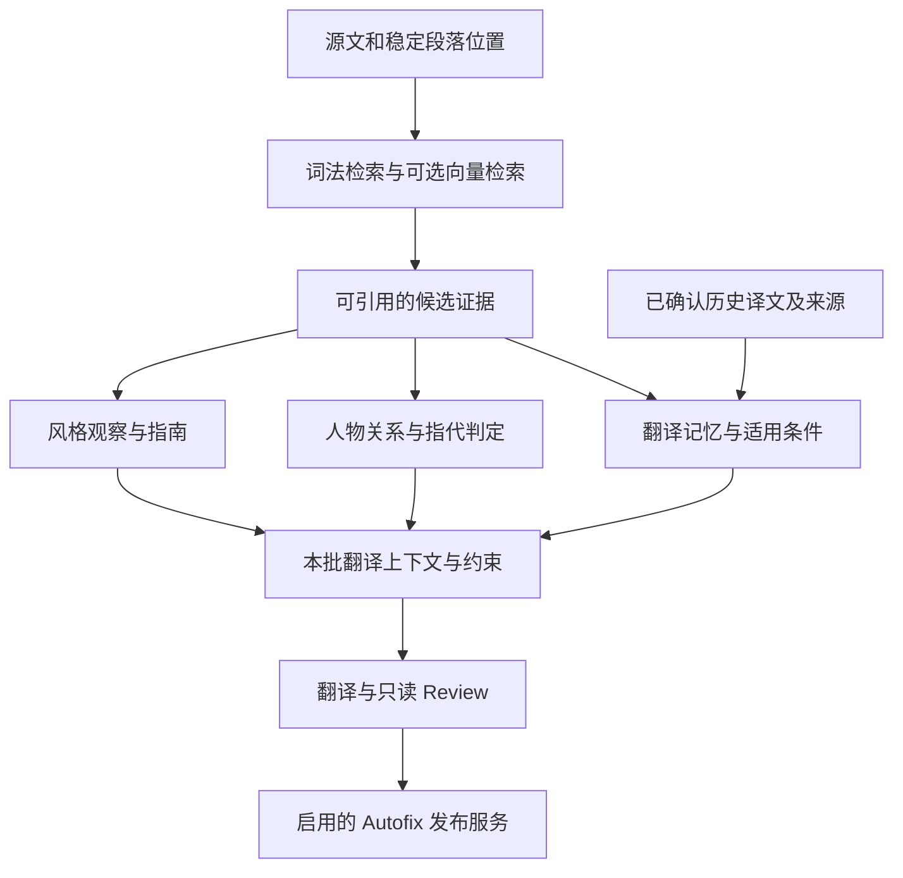

# Wenyi 项目审查与规划 · 2026-09-05

[English](../../../project-review/2026-09-05/README.md)

本次审查发现 **9 项可复现缺陷**，形成 **10 项未来规划**（包含用户补充的语义检索、重复句一致性、风格分析、人物关系证据及多语言国际化）；每项各有一份独立文档和英文对应版本。建议先修复正式译文发布、源文件保护及字幕正确性，再推进质量评测和内部重构。仓库已经具备较好的分层、状态和离线测试基础，当前最需要补强的是故障组合与边界条件。

## 审查基线与范围

- 源码基线：`15943b97592dc38ef9712412b6fd83a41951e1ca`。审查开始时没有已跟踪源码修改。
- 环境：本地 Linux，Python 3.12.13；未在本次会话执行 Python 3.10、Windows/macOS 或发行包实测。
- 阅读范围：CLI/配置、Orchestrator 与领域服务、状态与锁、翻译/预扫/Review/Autofix、字幕、术语与取证、导出与 HTML 资源、HTTP bridge、相关测试、双语使用文档及 CI。
- 方法：源码与测试交叉阅读，全量离线测试，针对具体假设的临时数据复现。格式实现做定向审查与现有回归验证，未逐行穷尽全部 EPUB/DOCX/PDF 实现。
- 未读取私有书籍或既有运行数据；已有未跟踪 `review-20260812-075714-029447/` 未纳入审查、未改动。其他本地书籍、state、output、缓存也未作为 fixture 使用。
- 未调用真实 LLM、embedding、MinerU、BabelDOC，也未核验远端 CI 状态、分支保护或当前 provider 定价。缺陷结论基于该源码快照与明确列出的本地实验；历史源码链接固定到审查提交，避免后续改动导致行号漂移；新增 P06/P08/P09 另查阅并链接相关原始研究，P10 引用了语言标签标准与 Python 官方资源文档，检索未包含用户书籍正文。这些研究提供设计参考，不代表新能力已在 Wenyi 验证。

## 修改建议：每点一份文档

P1 表示应优先修复的源文件/正式译文保护、确定性或完成状态问题；P2 表示在特定输入、配置或恢复条件下影响正确性、质量或可诊断性的问题。没有将未经验证的推测列为已复现缺陷。

| 独立文档 | 优先级 | 证据状态 |
|---|---|---|
| [F01 · 关闭 Autofix 时，中断恢复仍会发布正式译文](f01-autofix-disable-on-resume.md) | P1 | 已复现 |
| [F02 · 显式导出路径可覆盖输入文件，事后哈希检查无法保护源文](f02-export-source-protection.md) | P1 | 已复现 |
| [F03 · 字幕末尾滑窗重复拥有同一字幕，结果受完成顺序影响](f03-srt-window-determinism.md) | P1 | 已复现 |
| [F04 · 字幕失败与空译文被标为完成，续跑无法补译](f04-srt-failure-state.md) | P1 | 已复现 |
| [F05 · Review 缓存身份遗漏模型和术语证据字段](f05-review-cache-identity.md) | P2 | 已复现 |
| [F06 · 补齐失败的章节梗概后，全书概览仍复用不完整结果](f06-prescan-synopsis-invalidation.md) | P2 | 已复现 |
| [F07 · HTML 本地资源路径限制可被符号链接绕过](f07-html-resource-symlinks.md) | P2 | 已复现 |
| [F08 · 可预期的语言识别与配置错误未统一转换为简洁 CLI 提示](f08-cli-error-contract.md) | P2 | 已复现 |
| [F09 · 同一字幕状态缺少运行锁，多写者会竞争临时文件](f09-srt-run-lock.md) | P1 | 已复现 |

其中 F03 通过反转窗口合并顺序构造确定性反例；F09 通过两个独立 store 的同步双写复现底层竞态，尚未进行完整多进程 CLI 压力测试。各文档分别给出触发条件、源码位置、修改范围、验收标准及估时，避免把实验边界当作生产环境发生率。

## 未来规划：每点一份文档

- [P01 · 为持久化状态建立版本与可验证恢复工具](p01-state-evolution-and-recovery.md)
- [P02 · 建立长篇质量基准，并以完整覆盖评估预扫改进](p02-long-form-quality-evaluation.md)
- [P03 · 建立统一请求预算、并发限制与取消机制](p03-request-budgets-and-backpressure.md)
- [P04 · 拆分 Review 状态机并收紧跨服务数据契约](p04-review-state-machine-refactor.md)
- [P05 · 将代码、格式产物与发行包验证纳入持续集成](p05-ci-and-release-validation.md)
- [P06 · 引入向量语义检索，建立可追溯的全书证据召回](p06-semantic-evidence-retrieval.md)
- [P07 · 建立翻译记忆，统一同义同境的重复表达](p07-translation-memory-consistency.md)
- [P08 · 以分层采样和原文证据增强风格分析](p08-evidence-backed-style-analysis.md)
- [P09 · 建立人物关系与指代证据，确定兄弟长幼等翻译歧义](p09-character-kinship-evidence.md)
- [P10 · 多语言互译与提示词国际化（2026-09-06 已实现实验版）](p10-multilingual-internationalization.md)

P01–P09 是可拆分的候选工作；P10 已按后续请求实现第一版实验功能。多语言真实质量与剩余国际化阶段见 P10，GUI/Web 和新增格式继续暂缓。

## 新增质量方向的共同设计

四项能力共用稳定的原文位置与版本化证据，但各自负责不同判断。

| 能力 | 提供什么 | 作出确定结论的条件 |
|---|---|---|
| P06 语义检索 | 可能相关的源段和历史表达 | 只负责候选召回；排序分数不等于事实成立或句义相同 |
| P07 翻译记忆 | 重复表达的已确认译法和允许差异 | 核对语义、说话人、指代和风格范围；近似句先作参考 |
| P08 风格分析 | 带样本证据的全书/局部译法指南 | 样本覆盖充分，支持与反例可核验；保留角色差异 |
| P09 人物关系 | 某人与谁有什么关系、长幼及指代候选 | 原文证据、实体身份、关系方向与叙事范围均成立；不足则保留未知 |



兄弟长幼是关系方向问题：即使 `brother` 已指向某个人，也还需知道相对谁年长。全书证据可以帮助理解，但不得把后文才揭示的信息提前写进译文。缓存和重复译文也不能代替独立原文证据。

## 建议执行顺序

| 里程碑 | 工作范围 | 进入下一阶段的条件 |
|---|---|---|
| M1：下一次稳定性发布 | F01、F02 的路径保护、F03、F04、F09；P05 的基础 lint 可同步做 | 禁用发布不改正式 target；源路径不被覆盖；字幕乱序/失败/并发恢复的回归全部通过 |
| M2：缓存与诊断 | F05、F06、F07、F08；P01 只读诊断；完善 F02 原子产物发布 | 语义输入变化拒绝旧缓存，部分预扫恢复正确，预期错误可操作，导出失败不损坏已有成品 |
| M3：质量与资源控制 | P02、P03、P05 打包及格式验证 | 有长篇前后对照报告、可测预算与取消语义、可复现的发行包 smoke |
| M4：状态演进与内部结构 | P01 迁移/账本协议、P04 | 迁移可审查且保留身份，重构在既有质量和恢复基线上通过全量验证 |

按单人推进粗估：M1 约 2–3 周，M2 约 2–3 周，M3 约 3–4 周，M4 约 2–4 周。各阶段可按职责并行，日期不是交付承诺；估时不含真实模型评测、外部服务协调与人工长篇审校。P01/P03 的账本接口需要先定契约，P04 应在已修复行为和质量基准之后进行。

新增质量方向按以下增量推进，**不包含在上面的 M1–M4 估时内**。无需等待所有内部重构结束，但应先完成相关正确性修复和 P02 的最小评测集。

| 增量 | 内容 | 验收重点 |
|---|---|---|
| Q1：可解释的基础能力 | P07 精确记忆与差异报告、P08 分层采样、P09 明确姓名/older/younger 证据报告 | 原文引用可核验，重复句允许合理变化，证据不足不猜长幼 |
| Q2：语义召回 | P06 只读检索及混合策略评测，接关系和风格查询 | 相对词法基线的召回收益、困难负例误召回、可恢复索引与预算 |
| Q3：组合质量控制 | P07 条件复用、P08 分层指南、P09 跨章推导和叙事范围约束 | 不因一致性损伤原意，不提前泄露身份，修订仍走 Review/Autofix 边界 |

P06 的检索接口先定；P07/P08/P09 的首版可使用已有词法与上下文证据，避免相互等待。各项原型和后续工程量见独立文档；真实 embedding、模型及长篇盲评费用另计。

## 验证结果与复现

| 检查 | 结果 |
|---|---|
| `uv run --no-sync pytest -q` | 初次审查基线：**562 passed, 44 subtests passed**；P10 的后续功能验证单独记录 |
| 规划关联现有测试：preparation、glossary_agents、review_agent、translator、architecture_boundaries、orchestrator_contract | **105 passed, 3 subtests passed**；验证现有基线，不代表 P06–P09 已实现 |
| P10 验证，含英语默认文案和元数据约束（2026-09-06） | **611 passed, 44 subtests passed**；其中多语言与元数据语言测试共 49 项，未调用真实模型 |
| P10 包资源验证 | 隔离源码副本构建 wheel/sdist；54 份资源逐字节一致，另一工作目录从 wheel 运行 `languages` 通过 |
| `uv run --no-sync ruff check .` | 通过 |
| `uv run --no-sync ruff format --check .` | 通过 |
| 公共复现脚本 | F01–F09 全部观察到文档描述的症状 |
| 文档验证 | 40 份 Markdown 本地链接、源码行号、双语文件配对及空白检查通过 |
| `git diff --check` | 通过；新增未跟踪文档另做空白检查 |

以下脚本描述的是审查基线的旧症状，应在对应源码基线的工作目录运行；当前工作树的 F08 行为已变化：

```bash
UV_CACHE_DIR=/tmp/wenyi-uv-cache uv run --no-sync python docs/project-review/2026-09-05/reproduce.py
```

[查看离线复现脚本](../../../project-review/2026-09-05/reproduce.py)。它仅使用自行构造的临时数据和 FakeClient；全部生成数据位于 `/tmp/wenyi-review-*` 的临时目录并自动清理。F02 只覆盖它自己创建的临时源文件，F07 只读取它自己创建的无害链接目标。脚本按审查基线断言旧症状，**不是修复后应长期通过的回归测试**；未来修复时应把每个反例转换为验证预期行为的正式测试。

## 交付状态与限制

本轮审查及规划补充累计新增两种语言共 40 份 Markdown（每种语言 19 个独立主题与 1 个索引），以及 1 份共享复现脚本。2026-09-05 的审查与前九项规划未修改产品源码、配置、现有测试或 CI；2026-09-06 的 P10 已新增功能实现、测试和文档，详见独立文档。未暂存、提交或推送。P06–P09 本次仅形成设计文档，未建立真实向量索引、翻译记忆或人物关系库。

后续 P10 实现已修复 F08 中复现的语言检测失败与损坏 YAML 的 CLI 展示；其余审查缺陷仍需按各文档推进。现有测试通过不能证明所有中断窗口、多进程写入、格式保真或真实翻译质量均已覆盖；本报告也不是全面安全审计。优先项已给出可实施的最小改动与回归方向，后续可据此逐项创建修复 PR。
