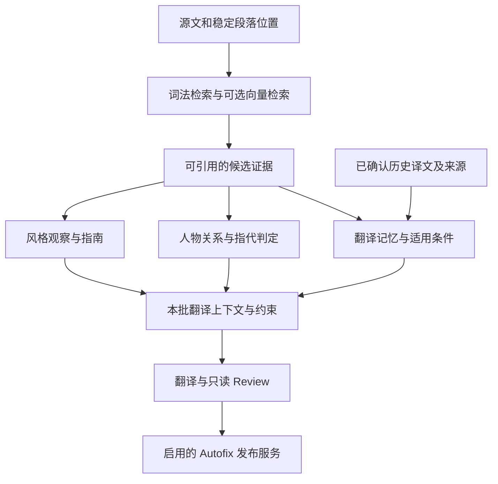

# 项目审查与保留规划

[English](../../../project-review/2026-09-05/README.md)

2026-09-17 清理：已删除完成的七项重构设计及 P04 Review 拆分、P10 多语言首版设计。
当前实现见[模块职责](../../architecture.md)、[配置](../../configuration.md)、
[翻译流程](../../pipeline.md)和 [Web 部署](../../web.md)。旧里程碑、工期估算
和“Web 尚未实现”等结论已移除，不能继续作为当前待办。

## 保留规划

P01/P02/P06–P09 仍保留后续设计价值；P03/P05 已部分落地，其余内容需要重新核对现状，
不应按 2026-09-05 的实现基线重复开发。编号保持不变，便于继续引用独立设计。

- [P01 · 状态演进与可验证恢复](p01-state-evolution-and-recovery.md)
- [P02 · 长篇质量基准](p02-long-form-quality-evaluation.md)
- [P03 · 预算与资源控制：部分实现](p03-request-budgets-and-backpressure.md)
- [P05 · CI 与发行验证：部分实现](p05-ci-and-release-validation.md)
- [P06 · 向量语义证据检索](p06-semantic-evidence-retrieval.md)
- [P07 · 翻译记忆与一致性](p07-translation-memory-consistency.md)
- [P08 · 带原文证据的风格分析](p08-evidence-backed-style-analysis.md)
- [P09 · 人物关系、长幼与指代证据](p09-character-kinship-evidence.md)

## 新增质量方向的共同设计

四项能力共用稳定的原文位置与版本化证据，但各自负责不同判断。

| 能力 | 提供什么 | 作出确定结论的条件 |
|---|---|---|
| P06 语义检索 | 可能相关的源段和历史表达 | 只负责候选召回；排序分数不等于事实成立或句义相同 |
| P07 翻译记忆 | 重复表达的已确认译法和允许差异 | 核对语义、说话人、指代和风格范围；近似句先作参考 |
| P08 风格分析 | 带样本证据的全书/局部译法指南 | 样本覆盖充分，支持与反例可核验；保留角色差异 |
| P09 人物关系 | 某人与谁有什么关系、长幼及指代候选 | 原文证据、实体身份、关系方向与叙事范围均成立；不足则保留未知 |

兄弟长幼是关系方向问题：即使 `brother` 已指向某个人，也还需知道相对谁年长。全书证据可以帮助理解，但不得把后文才揭示的信息提前写进译文。缓存和重复译文也不能代替独立原文证据。

## 历史审查证据

以下 F01–F09 对应 `15943b97592dc38ef9712412b6fd83a41951e1ca` 的旧源码审查，
保留问题背景与边界案例，**不是当前未修复缺陷清单**。部分问题已有修复；实施新工作前
需检查当前代码及回归测试。原有复现脚本断言旧症状，只适用于对应历史检出版本，
不要作为当前测试执行。

- [F01 · 关闭 Autofix 时，中断恢复仍会发布正式译文](f01-autofix-disable-on-resume.md)
- [F02 · 显式导出路径可覆盖输入文件，事后哈希检查无法保护源文](f02-export-source-protection.md)
- [F03 · 字幕末尾滑窗重复拥有同一字幕，结果受完成顺序影响](f03-srt-window-determinism.md)
- [F04 · 字幕失败与空译文被标为完成，续跑无法补译](f04-srt-failure-state.md)
- [F05 · Review 缓存身份遗漏模型和术语证据字段](f05-review-cache-identity.md)
- [F06 · 补齐失败的章节梗概后，全书概览仍复用不完整结果](f06-prescan-synopsis-invalidation.md)
- [F07 · HTML 本地资源路径限制可被符号链接绕过](f07-html-resource-symlinks.md)
- [F08 · 可预期的语言识别与配置错误未统一转换为简洁 CLI 提示](f08-cli-error-contract.md)
- [F09 · 同一字幕状态缺少运行锁，多写者会竞争临时文件](f09-srt-run-lock.md)
